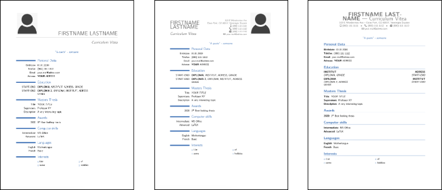

MainTitle: Usage of the template for a curriculum vitae
title: How is this template structured?
The template is based on ***moderncv***. This allows three different styles: **casual**, **classic** and **banking**:

---

title: What is the best way to get started?

Download the template, unzip the ZIP file and copy the files to a location of your choice. If you open the file ***curriculumVitae.tex*** in a *TeX* editor of your choice and compile it, you should see a *casual* style CV.

Now you can start entering your data.
