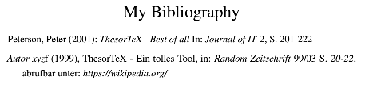
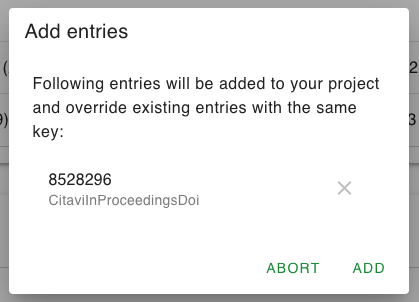
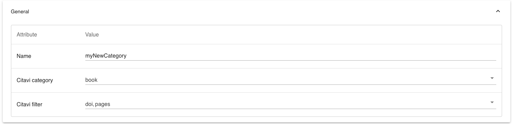
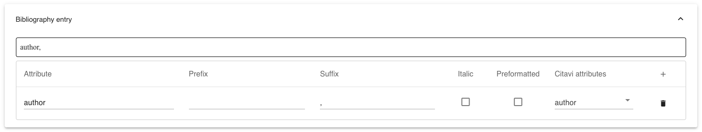

MainTitle: Verwendung des Tools für Literaturmanagement
title: Wofür kann ich dieses Tool benutzen?
Dieses Tool erleichtert das Erstellen und Formattieren von Literatureinträgen. Es baut auf der ***Vorlage für Haus- und Abschlussarbeiten*** auf.

Die Motivation hierfür war, dass Anpassungen an *BibLaTeX* sehr umständlich und kompliziert sein können. Der Funktionsumfang grob zusammengefasst ist:
- Erstelle Projekte auf Basis der Vorlage
- Erstelle und bearbeite Literatureinträge über die Weboberfläche
- Diese Literatureinträge kannst du dann ganz einfach in deinem Dokument zitieren
- Erstelle und bearbeite Literatur-Kategorien über die Weboberfläche
- Importiere deine Bibliothek oder einzelne Einträge aus Citavi
---
title: Wie fang ich am besten an?
Gehe auf die ***Downloads*** Seite und lade das Paket für dein Betriebssystem herunter. Wenn du die heruntergeladene ZIP-Datei entpackst, solltest du eine ausführbare Datei sehen. Kopiere diese Datei in den Ordner, in dem die LaTeX-Projekte erstellt werden sollen und starte sie über einen Doppelklick.

Jetzt taucht ein Terminal-Fenster bei dir auf, in welchem die Anwendung läuft. Sobald du dieses Fenster schließt, wird die Anwendung beendet. Außerdem wurde ein Ordner ***projects*** mit einem Beispielprojekt erstellt.

Wenn du die Adresse ***http://localhost:8448*** in einem Browser aufrufst, solltest du die Anwendung sehen.


Jetzt kannst du anfangen, im ***example***-Projekt die im folgenden beschriebenen Schritte durchzuführen. Oder du erstellt dein eigenes Projekt.

---

title: Wie kann ich einen Literatureintrag anlegen?

Navigiere zunächst in das Projekt, in dem du einen Eintrag hinzufügen möchtest. Klicke dazu auf den entsprechenden Listeneintrag auf der Startseite.


Unter *Literatureinträge* findest du bereits einen *testEntry*. Um einen neuen Eintrag zu erstellen, klicke auf das ***+***-Icon.

Unter *Allgemein* musst du nun einen im Projekt eindeutigen Schlüssel für den neuen Eintrag eingeben. Diesen wirst du verwenden, wenn du diesen Eintrag zitieren willst.


Sobald du eine Kategorie ausgewählt hast, werden die Felder dieser Kategorie angezeigt und du kannst Werte eingeben.


Oben kannst du sehen, wie der Eintrag im Literaturverzeichnis und in einem Zitat aussehen würde.

Wenn du auf das ***Speichern***-Icon in der Toolbar klickst, wird der Eintrag gespeichert. Wenn du nun zurück navigierst, siehst du deinen Eintrag in der Liste.


Wenn du die *main.tex* des Projektes nun kompilierts, solltest du folgende Einträge im Literaturverzeichnis sehen:



Und du kannst den Eintrag mit dem Schlüssel, den du vergeben hast, zitieren:

```latex
\citebib{myNewEntry}{S. 203-205}{vgl.}
```

---

title: Wie kann ich einen Literatureintrag bearbeiten?

Klicke den Eintrag, den du bearbeiten willst, in der *Projektübersicht* an. Nun kannst du die Felder und die Werte unter *Allgemein* nach Belieben ändern.
Wenn du den ***Speichern***-Button klickst wird der Eintrag in der Übersicht aktualisiert.

---

title: Wie kann ich Literatureinträge aus Citavi importieren?

Gehe zur ***Projektübersicht***. Wenn du auf ***Citavi-Export hochladen*** klickst, kannst du eine *.bib*-Datei auswählen und hochladen. Du kannst sie auch über *Drag and Drop* in den markierten Bereich ziehen.

Diese *.bib*-Datei kannst du über *Citavis* ***Exportieren*** Funktion erstellen oder auf Seiten wie *Springer Link* herunterladen.

Wenn ich eine .bib-Datei mit dem folgenden Inhalt hochlade

```latex
@INPROCEEDINGS{8528296,
  author={Suyanto, Yohanes},
  booktitle={2018 4th International Conference on Science and Technology (ICST)}, 
  title={Numbered Musical Notation and LATEX Document Integration}, 
  year={2018},
  volume={},
  number={},
  pages={1-6},
  doi={10.1109/ICSTC.2018.8528296}}
```

wird diese Datei analysiert und der Eintrag einer bekannten Literatur-Kategorie zugeordnet. Dies geschieht auf Basis der Attribute ***Citavi-Kategorie*** und ***Citavi-Filter*** (mehr dazu unter ***Wie kann ich eine neue Literatur-Kategorie erstellen?***).



Der *Key* kann kryptisch sein, da er direkt aus der *.bib*-Datei gelesen wird. Du kannst ihn im Nachhinein noch anpassen.

Nun kannst du die Einträge die du nicht hochladen möchtest, entfernen. Beachte, dass durch das Hochladen existierende Einträge mit denselben Schlüsseln überschrieben werden.

Wenn du auf ***Hinzufügen*** klickst, werden die Einträge deiner Liste hinzugefügt. Wenn du deine *tex*-Datei nun kompilierst, werden die hochgeladenen Einträge auch im Literaturverzeichnis auftauchen.

In der ***Projektübersicht*** kannst du die hochgeladenen Einträge öffnen und die Attribute und Felder anpassen.

---

title: Wie kann ich eine neue Literatur-Kategorie anlegen?

In den vordefinieren Literatur-Kategorien wurden die Kategorien aus *Citavi* versucht abzubilden. Falls du einen zusätzlichen erstellen möchtest, klicke in der Projektübersicht auf das ***+*** bei ***Kategorien für Einträge***.

Der ***Name*** der KAtegorie muss im Projekt eindeutig sein.
Die ***Citavi-Kategorie*** wird genutzt, um Uploads aus *Citavi* zuzuordnen.
Der ***Citavi-Filter*** kann gesetzt werden, um z.B. nur Einträge mit dem Attribut *doi* dieser Kategorie zuzuordnen.



Nun kannst du Felder unter ***Eintrag im Literaturverzeichnis*** und ***Zitate*** hinzufügen. Dabei kannst du pro Feld folgendes konfigurieren:

- Attribut: Der Name des Feldes
- Prefix: Ein Prefix, wie z.B. (
- Suffix: Ein Suffix, wie z.B. ) oder ein Komma
- Kursiv: Ob der Wert kursiv dargestellt werden soll
- Forformatiert: Siehe Was bedeutet Vorformatiert
- Citavi-Attribute: Die Felder im Citavi-Upload, welche diesem Feld zugeordnet werden sollen.



Beachte, dass Felder unter ***Zitate***, deren Attribut-Name unter ***Literatureintrag*** bereits existiert, als das selbe Attribut betrachtet werden.

---

title: Was bedeutet Vorformattiert?

In *LaTeX* sind bestimmte Zeichen vorbelegt und können nicht einfach so im Text verwendet werden, wie z.B. _. Deshalb werden solche Zeichen von der Anwendung *escaped*, bevor sie in die *csv*-Datei mit den Literatureinträgen geschrieben werden.

Unter Umständen möchte man dies aber verhindern. So z.B. wenn man selbst schon einen escaped Wert eingeben möchte. Dies wäre notwendig, um eine URL klickbar zu machen:


Sonderzeichen in dieser URL dürfen nämlich nicht separat escaped werden. Dies wird durch das ***Forformattiert*** Attribut verhindert.