MainTitle: Usage of the tool for bibliography management
title: What can I use this tool for?
This tool facilitates the creation and formatting of bibliography entries. It builds on the ***Template for academic papers***.

The motivation for this was that adjustments to *BibLaTeX* can be very cumbersome and complicated. The scope of functions is roughly summarised as follows:
- Create projects based on the template
- Create and edit bibliography entries via the web interface.
- You can then easily cite these bibliography entries in your document.
- Create and edit bibliography categories via the web interface
- Import your library or individual entries from Citavi

---

title: What is the best way to get started?
Go to the ***Downloads*** page and download the package for your operating system. When you unzip the downloaded ZIP file, you should see an executable file. Copy this file into the folder where the LaTeX projects are to be created and start it by double-clicking on it.

Now a terminal window will appear in which the application is running. As soon as you close this window, the application is closed. In addition, a folder ***projects*** with a sample project has been created.

If you call up the address ***http://localhost:8448*** in a browser, you should see the application.

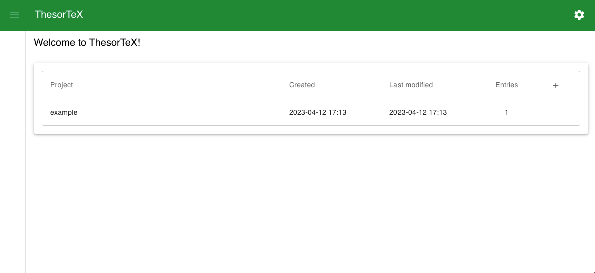

Now you can start do do the following steps in the ***example*** project. Or you can create your own project..

---

title: What happens when I start the application? (Security concerns)

The terms ***terminal window*** or ***localhost*** may seem a bit suspicious to you. And probably your computer warned you when you downloaded or started the application that you should be careful with files from the Internet. And he is right, so here is a brief explanation of what this application does.

This application interacts with two things on your computer: the file system and the local network.

Access to the file system is needed to create projects, literature entries and literature categories. You should be able to edit, move and delete the created folders and files. If this is not possible, please create a bug in the Github project.

Access to the local network is needed to make the application available in the browser. 
The term ***localhost*** refers to your computer. It is the default channel for connections to and from your computer.
The ***port*** defines the address at which the application can be reached. By default, this application uses port ***8448***.
But if another application is already running on this port, you must select a different port.

You may have heard the term ***HTTPS***. This is used to establish secure, encrypted connections to servers. You may also have noticed that the address of the application has only ***http*** and no ***https***.
This application runs locally and is only accessible from your computer. Therefore, *HTTPS* was not implemented in the first throw.

When you start the application by double-clicking, a ***terminal window*** opens. Since you don't see this with programs like *MS Word*, you may be wondering what it is.
The terminal is the *frame* in which the application runs. There you will see log messages (info and errors) and you can close the application. To do this, press ***STRG + C*** in the terminal or close the window.

If you have further questions or uncertainties, feel free to create an issue in ***Github*** and add the label ***question*** to it, or write a post in the discussion board.

---

title: How can I add a bibliography entry?

First navigate to the project in which you want to add an entry. To do this, click on the corresponding list entry on the start page.

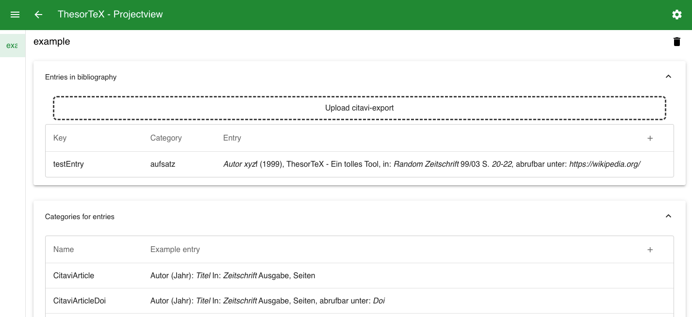

Under *bibliography entries* you will already find a *testEntry*. To create a new entry, click on the ***+*** icon.

Under *General* you must now enter a key for the new entry that is unique in the project. You will use this key when you want to cite this entry.

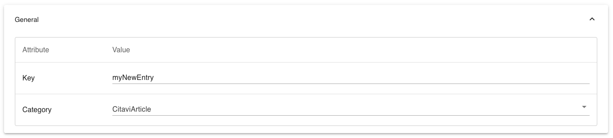

As soon as you have selected a category, the fields of this category are displayed and you can enter values.

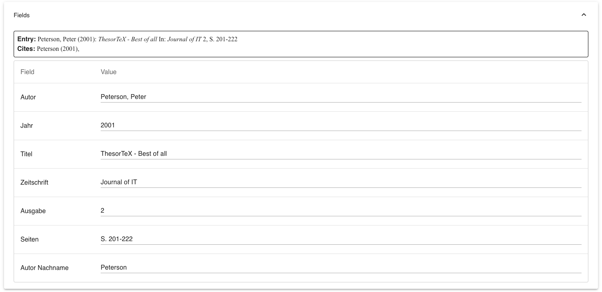

Above you can see how the entry would look in the bibliography and in a citation.

If you click on the ***Save*** icon in the toolbar, the entry is saved. If you now navigate back, you will see your entry in the list.

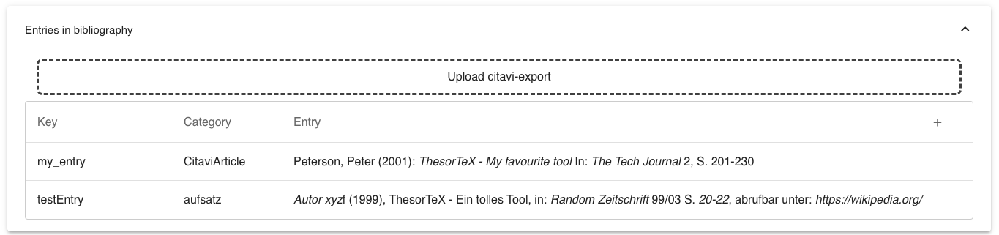

When you compile the *main.tex* of the project, you should see the following entries in the bibliography:

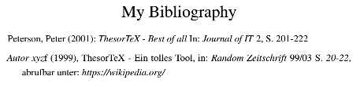

And you can cite your entry with the key you have given it:

```latex
\citebib{myNewEntry}{p.P. 203-205}{cf.}
```

title: How can I edit a bibliography entry?

Click on the entry you want to edit in the *Project overview*. Now you can change the fields and the values under *General* as you wish.
If you click the ***Save*** button, the entry will be updated in the overview.

---

title: How can I import bibliography entries from Citavi?

Go to the ***Project Overview***. If you click on ***Upload Citavi export***, you can select a *.bib* file and upload it. You can also drag and drop it into the marked area.

You can create this *.bib* file via *Citavis* ***Export*** function or download it from sites like *Springer Link*.

If I upload a .bib file with the following content

```latex
@INPROCEEDINGS{8528296,
  author={Suyanto, Yohanes},
  booktitle={2018 4th International Conference on Science and Technology (ICST)}, 
  title={Numbered Musical Notation and LATEX Document Integration}, 
  year={2018},
  volume={},
  number={},
  pages={1-6},
  doi={10.1109/ICSTC.2018.8528296}}
```

this file is analysed and the entry is assigned to a known bibliography category. This is done on the basis of the attributes ***Citavi category*** and ***Citavi filter*** (for more information see ***How can I create a new bibliography category?***).

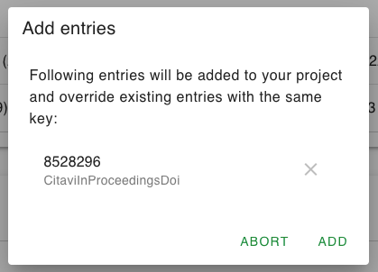

The *key* can be cryptic, because it is read directly from the *.bib* file. You can change it afterwards.

Now you can remove the entries you do not want to upload. Note that uploading will overwrite existing entries with the same keys.

If you click on ***Add***, the entries will be added to your list. When you compile your *tex* file, the uploaded entries will also appear in the bibliography.

In the ***project overview*** you can open the uploaded entries and adjust the attributes and fields.

---

title: How can I create a new bibliography category?

In the predefined bibliography categories, the categories from *Citavi* have been tried to be reproduced. If you want to create an additional one, click on the ***+*** at ***Categories for entries*** in the project overview.

The ***name*** of the category must be unique in the project.
The ***Citavi category*** is used to assign uploads from *Citavi*.
The ***Citavi filter*** can be set to e.g. only assign entries with the attribute *doi* to this category.

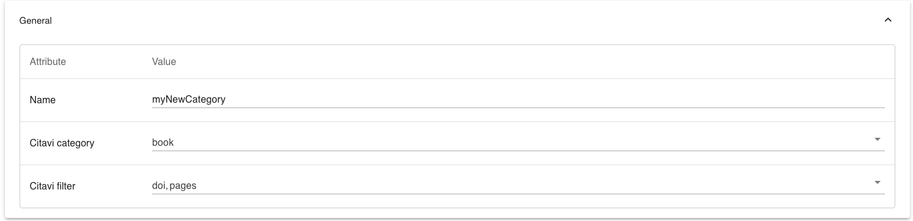

Now you can add fields under ***entry in bibliography*** and ***citations***. You can configure the following for each field:

- Attribute: The name of the field
- Prefix: A prefix, such as (
- Suffix: A suffix, such as ) or a comma.
- Italic: Whether the value should be displayed in italics.
- Forformatted: See What does Preformatted mean?
- Citavi Attributes: The fields in the Citavi upload that should be associated with this field.

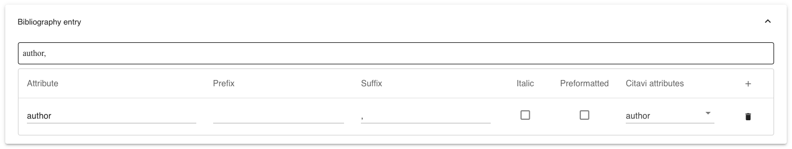

Note that fields under ***Citations*** whose attribute name already exists under ***bibliography entry*** are considered the same attribute.

---

title: What does Preformatted mean?

In *LaTeX*, certain characters are occupied and cannot simply be used in the text, such as _. Therefore, such characters are *escaped* by the application before they are written into the *csv* file with the bibliography entries.

Under certain circumstances, however, you may want to prevent this. For example, if you want to enter an escaped value yourself. This would be necessary to make an URL clickable:

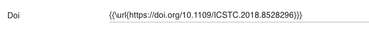

Special characters in this URL must not be escaped separately. This is prevented by the ***Preformatted*** attribute.

---

title: Which settings can I change?

If you click on the cogwheel at the top right, a configuration dialogue appears.

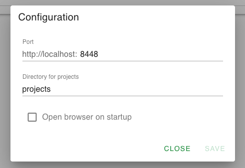

There you can enter the ***Port*** on which the application should run. By default this is *8448*, but you can also specify another port of your choice. 
After saving, you have to restart the application once and then it will run on the port you selected.

Secondly, you can specify the ***Directory for projects***. The projects are saved in this directory. The path is relative to the storage location of the application.

You can also activate the browser to open automatically with the correct address as soon as you start the application.
