# Verwendung des Tools für Literaturmanagement
## Wofür kann ich dieses Tool benutzen?
Dieses Tool erleichtert das Erstellen und Formattieren von Literatureinträgen. Es baut auf der ***Vorlage für Haus- und Abschlussarbeiten*** auf.

Die Motivation hierfür war, dass Anpassungen an *BibLaTeX* sehr umständlich und kompliziert sein können. Der Funktionsumfang grob zusammengefasst ist:
- Erstelle Projekte auf Basis der Vorlage
- Erstelle und bearbeite Literatureinträge über die Weboberfläche
- Diese Literatureinträge kannst du dann ganz einfach in deinem Dokument zitieren
- Erstelle und bearbeite Literatur-Kategorien über die Weboberfläche
- Importiere deine Bibliothek oder einzelne Einträge aus Citavi

---

## Wie fang ich am besten an?
Gehe auf die ***Downloads*** Seite und lade das Paket für dein Betriebssystem herunter. Wenn du die heruntergeladene ZIP-Datei entpackst, solltest du eine ausführbare Datei sehen. Kopiere diese Datei in den Ordner, in dem die LaTeX-Projekte erstellt werden sollen und starte sie über einen Doppelklick.

Jetzt taucht ein Terminal-Fenster bei dir auf, in welchem die Anwendung läuft. Sobald du dieses Fenster schließt, wird die Anwendung beendet. Außerdem wurde ein Ordner ***projects*** mit einem Beispielprojekt erstellt.

Wenn du die Adresse [](http://localhost:8448) in einem Browser aufrufst, solltest du die Anwendung sehen.

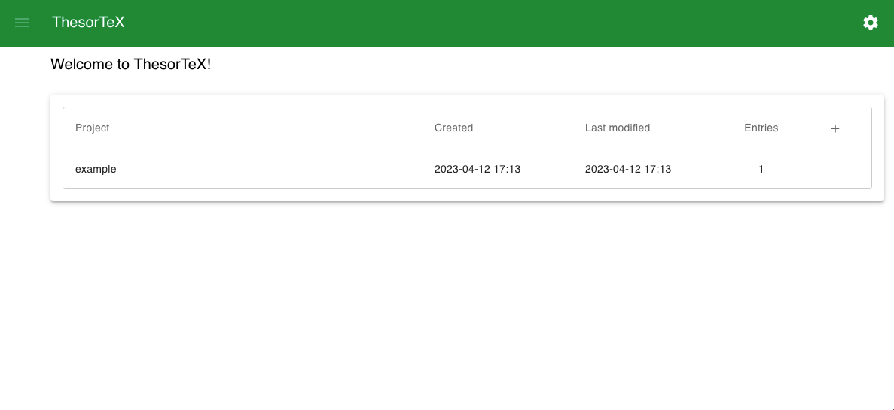

Jetzt kannst du anfangen, im ***example***-Projekt die im folgenden beschriebenen Schritte durchzuführen. Oder du erstellt dein eigenes Projekt.

---

## Was passiert, wenn ich die Anwendung starte? (Bedenken bzgl. Sicherheit)

Die Begriffe ***Terminal-Fenster*** oder ***localhost*** wirken vielleicht etwas suspekt auf dich. Und vermutlich hat dein Computer dich beim Download oder beim Starten der Anwendung gewarnt, dass man mit Dateien aus dem Internet vorsichtig sein sollte. Und da hat er Recht, deshalb wird hier kurz erklärt, was diese Anwendung macht.

Diese Anwendung interagiert mit zwei Dingen auf deinem Computer: Dem Dateisystem und dem lokalen Netzwerk.

Der Zugriff auf das Dateisystem wird benötigt, um Projekte, Literatureinträge und Literaturkategorien erstellen zu können. Die erstellten Ordner und Dateien sollten dabei von dir bearbeitet, verschoben und gelöscht werden können. Falls dies nicht geht, lege bitte einen Bug im [Github-Projekt](https://github.com/TimoSto/ThesorTeX/issues) an.

Der Zugriff auf das lokale Netzwerk wird benötigt, um die Anwendung im Browser verfügbar zu machen. 
Der Begriff ***localhost*** bezieht sich auf deinen Computer. Es ist der Standard-Kanal für Verbindungen auf und mit deinem Computer.
Der ***Port*** legt die Adresse fest, unter welcher die Anwendung zu erreichen ist. Standardmäßig verwendet diese Anwendung den Port ***8448***.
Aber wenn auf diesem Port bereits eine andere Anwendung läuft, musst du einen anderen Port auswählen.

Du hast vielleicht schon mal den Begriff ***HTTPS*** gehört. Damit werden sichere, verschlüsselte Verbindungen zu Servern hergestellt. Dir ist vielleicht auch aufgefallen, dass die Adresse der Anwendung nur ein ***http*** hat und kein ***https***.
Diese Anwendung läuft lokal und ist nur von deinem Computer aus erreichbar. Deshalb wurde *HTTPS* im ersten Wurf nicht umgesetzt.

Wenn du die Anwendung durch einen Doppelklick startest, wird ein ***Terminal-Fenster*** geöffnet. Da man sowas bei Programmen wie *MS Word* nicht sieht, fragst du dich vielleicht, was das ist.
Das Terminal ist der *Rahmen* in dem die Anwendung läuft. Dort siehst du Log-Nachrichten (Info und Fehler) und du kannst die Anwendung wieder beenden. Drücke dazu ***STRG + C*** im Terminal oder schließe das Fenster.

Wenn du weitere Fragen oder Unsicherheiten hast, lege gern ein Issue in [Github](https://github.com/TimoSto/ThesorTeX/issues) an und füge diesem das Label ***question*** hinzu, oder schreibe einen Beitrag in die [Diskussionsrunde](https://github.com/TimoSto/ThesorTeX/discussions/158).

---

## Wie kann ich einen Literatureintrag anlegen?

Navigiere zunächst in das Projekt, in dem du einen Eintrag hinzufügen möchtest. Klicke dazu auf den entsprechenden Listeneintrag auf der Startseite.

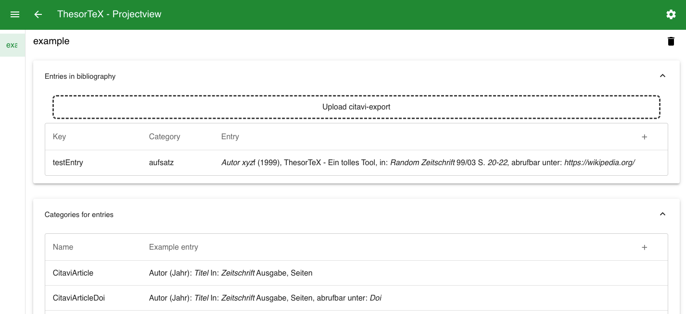

Unter *Literatureinträge* findest du bereits einen *testEntry*. Um einen neuen Eintrag zu erstellen, klicke auf das ***+***-Icon.

Unter *Allgemein* musst du nun einen im Projekt eindeutigen Schlüssel für den neuen Eintrag eingeben. Diesen wirst du verwenden, wenn du diesen Eintrag zitieren willst.

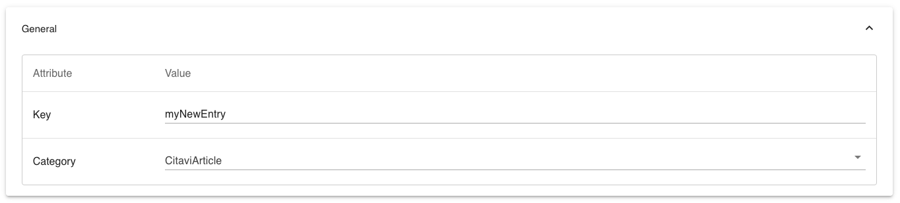

Sobald du eine Kategorie ausgewählt hast, werden die Felder dieser Kategorie angezeigt und du kannst Werte eingeben.

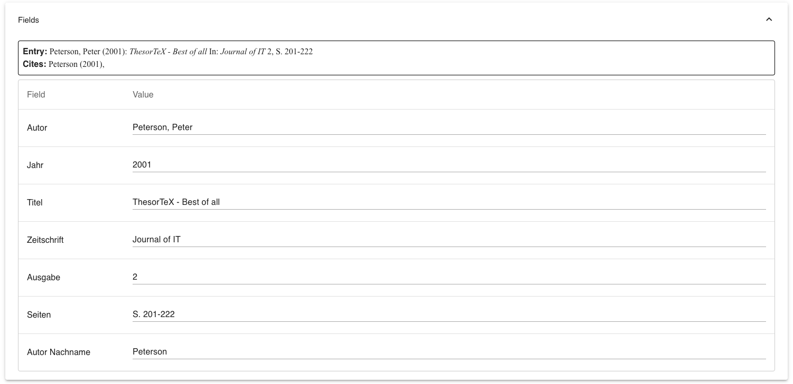

Oben kannst du sehen, wie der Eintrag im Literaturverzeichnis und in einem Zitat aussehen würde.

Wenn du auf das ***Speichern***-Icon in der Toolbar klickst, wird der Eintrag gespeichert. Wenn du nun zurück navigierst, siehst du deinen Eintrag in der Liste.

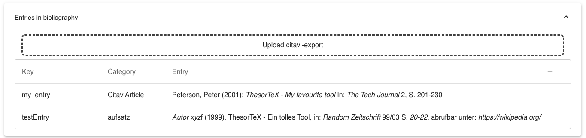

Wenn du die *main.tex* des Projektes nun kompilierts, solltest du folgende Einträge im Literaturverzeichnis sehen:

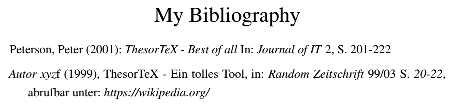

Und du kannst den Eintrag mit dem Schlüssel, den du vergeben hast, zitieren:

```latex
\citebib{myNewEntry}{S. 203-205}{vgl.}
```

---

## Wie kann ich einen Literatureintrag bearbeiten?

Klicke den Eintrag, den du bearbeiten willst, in der *Projektübersicht* an. Nun kannst du die Felder und die Werte unter *Allgemein* nach Belieben ändern.
Wenn du den ***Speichern***-Button klickst wird der Eintrag in der Übersicht aktualisiert.

---

## Wie kann ich Literatureinträge aus Citavi importieren?

Gehe zur ***Projektübersicht***. Wenn du auf ***Citavi-Export hochladen*** klickst, kannst du eine *.bib*-Datei auswählen und hochladen. Du kannst sie auch über *Drag and Drop* in den markierten Bereich ziehen.

Diese *.bib*-Datei kannst du über *Citavis* ***Exportieren*** Funktion erstellen oder auf Seiten wie *Springer Link* herunterladen.

Wenn ich eine .bib-Datei mit dem folgenden Inhalt hochlade

```latex
@INPROCEEDINGS{8528296,
  author={Suyanto, Yohanes},
  booktitle={2018 4th International Conference on Science and Technology (ICST)}, 
  title={Numbered Musical Notation and LATEX Document Integration}, 
  year={2018},
  volume={},
  number={},
  pages={1-6},
  doi={10.1109/ICSTC.2018.8528296}}
```

wird diese Datei analysiert und der Eintrag einer bekannten Literatur-Kategorie zugeordnet. Dies geschieht auf Basis der Attribute ***Citavi-Kategorie*** und ***Citavi-Filter*** (mehr dazu unter ***Wie kann ich eine neue Literatur-Kategorie erstellen?***).

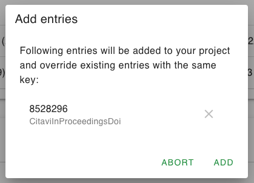

Der *Key* kann kryptisch sein, da er direkt aus der *.bib*-Datei gelesen wird. Du kannst ihn im Nachhinein noch anpassen.

Nun kannst du die Einträge die du nicht hochladen möchtest, entfernen. Beachte, dass durch das Hochladen existierende Einträge mit denselben Schlüsseln überschrieben werden.

Wenn du auf ***Hinzufügen*** klickst, werden die Einträge deiner Liste hinzugefügt. Wenn du deine *tex*-Datei nun kompilierst, werden die hochgeladenen Einträge auch im Literaturverzeichnis auftauchen.

In der ***Projektübersicht*** kannst du die hochgeladenen Einträge öffnen und die Attribute und Felder anpassen.

---

## Wie kann ich eine neue Literatur-Kategorie anlegen?

In den vordefinieren Literatur-Kategorien wurden die Kategorien aus *Citavi* versucht abzubilden. Falls du einen zusätzlichen erstellen möchtest, klicke in der Projektübersicht auf das ***+*** bei ***Kategorien für Einträge***.

Der ***Name*** der KAtegorie muss im Projekt eindeutig sein.
Die ***Citavi-Kategorie*** wird genutzt, um Uploads aus *Citavi* zuzuordnen.
Der ***Citavi-Filter*** kann gesetzt werden, um z.B. nur Einträge mit dem Attribut *doi* dieser Kategorie zuzuordnen.

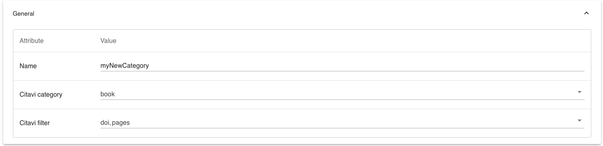

Nun kannst du Felder unter ***Eintrag im Literaturverzeichnis*** und ***Zitate*** hinzufügen. Dabei kannst du pro Feld folgendes konfigurieren:

- Attribut: Der Name des Feldes
- Prefix: Ein Prefix, wie z.B. (
- Suffix: Ein Suffix, wie z.B. ) oder ein Komma
- Kursiv: Ob der Wert kursiv dargestellt werden soll
- Vorformatiert: Siehe Was bedeutet Vorformatiert
- Citavi-Attribute: Die Felder im Citavi-Upload, welche diesem Feld zugeordnet werden sollen.

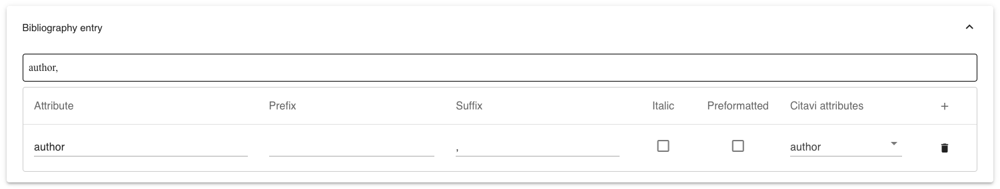

Beachte, dass Felder unter ***Zitate***, deren Attribut-Name unter ***Literatureintrag*** bereits existiert, als das selbe Attribut betrachtet werden.

---

## Was bedeutet Vorformattiert?

In *LaTeX* sind bestimmte Zeichen vorbelegt und können nicht einfach so im Text verwendet werden, wie z.B. _. Deshalb werden solche Zeichen von der Anwendung *escaped*, bevor sie in die *csv*-Datei mit den Literatureinträgen geschrieben werden.

Unter Umständen möchte man dies aber verhindern. So z.B. wenn man selbst schon einen escaped Wert eingeben möchte. Dies wäre notwendig, um eine URL klickbar zu machen:

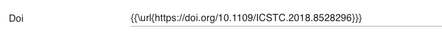

Sonderzeichen in dieser URL dürfen nämlich nicht separat escaped werden. Dies wird durch das ***Vorformattiert*** Attribut verhindert.

---

## Welche Einstellungen kann ich ändern?

Wenn du auf das Zahnrad oben rechts klickst, erscheint ein Konfigurations-Dialog.

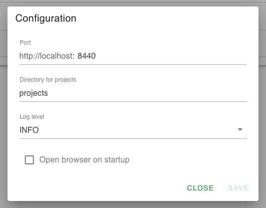

Dort kannst du zum einen den ***Port*** angeben, auf welchem die Anwendung laufen soll. Standardmäßig ist dies *8448*, aber du kannst auch einen anderen Port deiner Wahl angeben. 
Nach dem Speichern musst du die Anwendung einmal neu starten und dann läuft sie auf dem von dir ausgewählen Port.

Zum anderen kannst du das ***Verzeichnis für Projekte*** angeben. In diesem werden die Projekte gespeichert. Der Pfad ist relativ zum Speicherort des Programmes.

Das ***Log-Level*** bezieht sich auf die Filterung der Log-Meldumgen im Terminal-Fenster. Zur Auswahl stehen *ERROR*,
*WARNING*, *INFO* und *DEBUG*, wobei höhere Level wie *INFO* niedrigere Level wie
*ERROR* einschließen. Der Standard-Wert ist *INFO*.

Außerdem kannst du aktivieren, dass sich der Browser mit der richtigen Adresse automatisch öffnet, sobald du die Anwendung startest.
